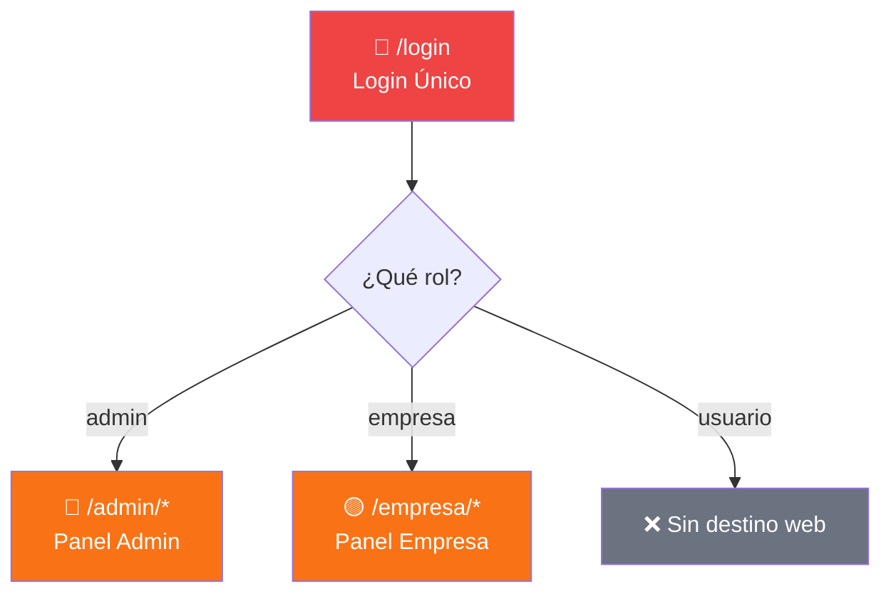
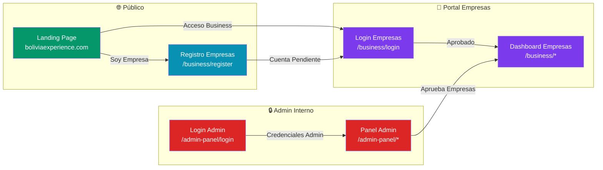
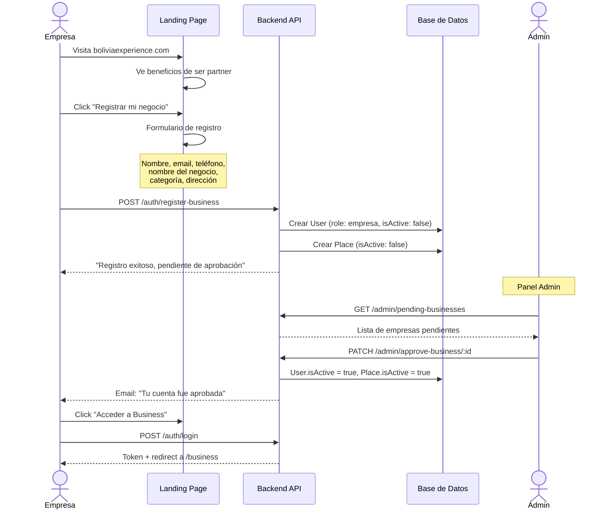
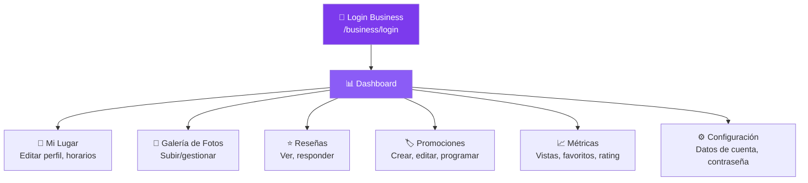
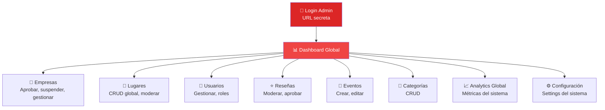
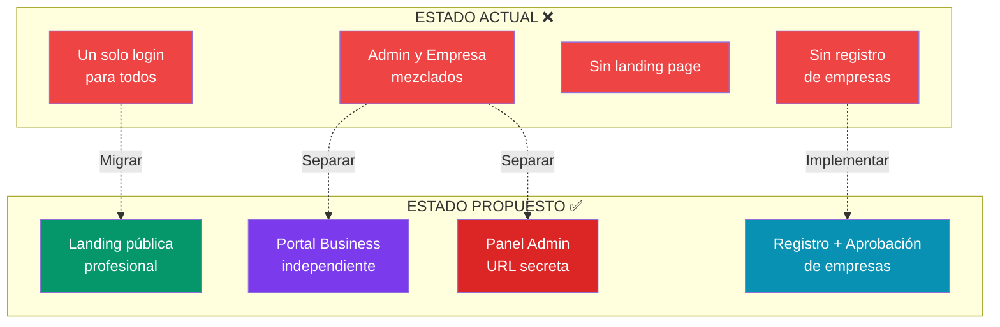

# BoliviaExperience — Análisis Estratégico de Producto

## Parte 1: Verificación de Correcciones de Bugs

| # | Bug | Archivo | Estado | Detalle |
|---|-----|---------|--------|---------|
| 1 | Promotions sin paginación | [promotions.service.ts](file:///c:/Users/HP/Documents/Proyectos/proy_pierre/bolivia_experience_project/api/src/modules/promotions/promotions.service.ts) | ✅ Corregido | `findAll()` y `findActive()` ahora retornan `PaginatedResponse` con `page`, `limit`, `skip` |
| 2 | Booleano `all` sin `@Transform` | [promotions.controller.ts](file:///c:/Users/HP/Documents/Proyectos/proy_pierre/bolivia_experience_project/api/src/modules/promotions/promotions.controller.ts#L25-L31) | ✅ Corregido | `@Transform({ obj })` con parsing explícito. `placeId` añadido como filtro opcional |
| 3 | Booleano `upcoming` sin `@Transform` | [events.controller.ts](file:///c:/Users/HP/Documents/Proyectos/proy_pierre/bolivia_experience_project/api/src/modules/events/events.controller.ts#L24-L30) | ✅ Corregido | `@Transform({ obj })` aplicado correctamente |
| 4 | `mode: 'insensitive'` en SQLite | [admin.service.ts](file:///c:/Users/HP/Documents/Proyectos/proy_pierre/bolivia_experience_project/api/src/modules/admin/admin.service.ts#L17-L20) | ✅ Corregido | `mode: 'insensitive'` eliminado (SQLite es case-insensitive por defecto en `contains`) |
| 5 | Empresa ve todas las promociones | [empresa/Promotions.tsx](file:///c:/Users/HP/Documents/Proyectos/proy_pierre/bolivia_experience_project/web/src/pages/empresa/Promotions.tsx#L41) | ✅ Corregido | Ahora pasa `placeId: place?.id` al hook |

> [!NOTE]
> El hook [usePromotions](file:///c:/Users/HP/Documents/Proyectos/proy_pierre/bolivia_experience_project/web/src/hooks/usePromotions.ts#L4) también fue actualizado para aceptar `placeId` como parámetro. Todas las correcciones son consistentes entre frontend y backend.

---

## Parte 2: Diagnóstico de la Arquitectura Actual

### Problemas Críticos Identificados



#### 🔴 Problemas de Seguridad
- **URL única de login**: Cualquiera que acceda a `/login` ve el formulario que dice "Panel Administrativo". Un externo (empresa) ve la misma pantalla que el equipo interno.
- **Sin aislamiento de rutas**: Admin (`/admin`) y Empresa (`/empresa`) comparten el mismo dominio, la misma app, y la misma página de login.
- **El panel admin debería ser secreto**: Actualmente se accede por la URL raíz `/login`.

#### 🟡 Problemas de UX
- **Login genérico**: Dice "Panel Administrativo" para todos los usuarios — confuso para una empresa aliada.
- **Sin registro de empresas**: No existe flujo de auto-registro para negocios nuevos.
- **Sin aprobación**: No hay estado "pendiente" para empresas nuevas.
- **Sin landing page**: No existe una página pública que explique qué es BoliviaExperience ni invite a empresas a registrarse.

#### 🟠 Problemas Comerciales
- **Sin branding diferenciado**: El portal de empresa se llama "Mi Negocio" sin identidad visual del producto.
- **Sin onboarding**: Una empresa nueva no sabe qué hacer cuando entra.
- **Sin propuesta de valor visible**: No hay landing que venda los beneficios de ser partner.

---

## Parte 3: Propuesta de Arquitectura — Visión de Producto

### Benchmark: Referentes del rubro

| Plataforma | Modelo | Portal de Negocios | Qué hace bien |
|---|---|---|---|
| **TripAdvisor for Business** | Marketplace turístico | Portal separado para propietarios | Registro, gestión de reseñas, analytics, fotos |
| **TheFork (by TripAdvisor)** | Reservas restaurantes | Dashboard para restaurantes | Métricas, promociones, gestión de reservas |
| **Yelp for Business** | Reseñas locales | `biz.yelp.com` (subdominio separado) | Claim de negocio, ads, responder reseñas |
| **Google Business Profile** | Maps/Local | Plataforma completamente separada | Fotos, posts, Q&A, métricas |
| **Booking Extranet** | Viajes | Portal propio para hoteles | Revenue, inventario, promociones, analytics |

> [!IMPORTANT]
> **Patrón universal del rubro**: Todos sin excepción tienen portales separados para operadores internos vs. negocios aliados. Es el estándar de la industria.

---

### Nueva Arquitectura Propuesta



---

### Nomenclatura y Branding

| Componente | Nombre Actual | Nombre Propuesto |
|---|---|---|
| Portal de Empresas | "Mi Negocio" | **BoliviaExperience Business** |
| Panel de Admin | "Panel Administrativo" | **BoliviaExperience Admin** (URL secreta) |
| Landing Page | No existe | **BoliviaExperience** (landing principal) |

---

### Flujo de Usuarios Detallado

#### Flujo 1: Empresa Nueva (Registro → Aprobación → Operación)



#### Flujo 2: Empresa Activa (Operación diaria)



#### Flujo 3: Administrador Interno



---

### Jerarquía de Pantallas

#### 🏢 BoliviaExperience Business (Portal Empresas)

```
/business
├── /login                    → Login exclusivo para empresas
├── /register                 → Auto-registro (formulario público)
├── /                         → Dashboard (métricas de MI negocio)
├── /place                    → Editar mi lugar (perfil, horarios, mapa)
├── /photos                   → Galería de fotos
├── /reviews                  → Reseñas de mi lugar + responder
├── /promotions               → Mis promociones (CRUD)
├── /stats                    → Estadísticas detalladas
└── /settings                 → Mi cuenta, cambiar contraseña
```

#### 🔒 BoliviaExperience Admin (Panel Interno)

```
/admin-panel
├── /login                    → Login exclusivo para admins (URL secreta)
├── /                         → Dashboard global (stats del sistema)
├── /businesses               → Gestión de empresas (aprobar, suspender) ← NUEVO
├── /places                   → CRUD de todos los lugares
├── /users                    → Gestión de usuarios
├── /reviews                  → Moderación de reseñas
├── /events                   → CRUD de eventos
├── /promotions               → Vista global de promociones
├── /categories               → CRUD de categorías
└── /settings                 → Configuración del sistema
```

#### 🌐 Landing Page Pública

```
/ (raíz)
├── /                         → Hero + propuesta de valor
├── /#features                → Sección de features para empresas
├── /#how-it-works            → Cómo funciona
├── /#pricing                 → Planes (futuro)
├── /#testimonials            → Testimonios de partners
├── /#contact                 → Formulario de contacto
├── /business/login           → → Portal Business
└── /business/register        → → Registro de empresa
```

---

### Cambios de Routing en el Frontend

```diff
 // App.tsx — Nueva estructura de rutas
 <Routes>
-  <Route path="/login" element={<LoginPage />} />
+  {/* Landing Pública */}
+  <Route path="/" element={<LandingPage />} />
+
+  {/* Portal Empresas — BoliviaExperience Business */}
+  <Route path="/business/login" element={<BusinessLoginPage />} />
+  <Route path="/business/register" element={<BusinessRegisterPage />} />
+  <Route element={<ProtectedRoute roles={['empresa']} />}>
+    <Route path="/business" element={<BusinessLayout />}>
+      <Route index element={<BusinessDashboard />} />
+      <Route path="place" element={<BusinessPlace />} />
+      <Route path="reviews" element={<BusinessReviews />} />
+      <Route path="promotions" element={<BusinessPromotions />} />
+      <Route path="stats" element={<BusinessStats />} />
+      <Route path="photos" element={<BusinessPhotos />} />
+      <Route path="settings" element={<BusinessSettings />} />
+    </Route>
+  </Route>

-  {/* Admin Routes */}
+  {/* Admin Interno — URL secreta */}
+  <Route path="/admin-panel/login" element={<AdminLoginPage />} />
   <Route element={<ProtectedRoute roles={['admin']} />}>
-    <Route path="/admin" element={<AdminLayout />}>
+    <Route path="/admin-panel" element={<AdminLayout />}>
       <Route index element={<AdminDashboard />} />
+      <Route path="businesses" element={<AdminBusinesses />} />
       <Route path="users" element={<AdminUsers />} />
       <Route path="places" element={<AdminPlaces />} />
       ...
     </Route>
   </Route>

-  <Route path="*" element={<Navigate to="/login" replace />} />
+  <Route path="*" element={<Navigate to="/" replace />} />
 </Routes>
```

---

### Cambios de API Necesarios

#### Nuevos Endpoints

| Método | Ruta | Descripción | Rol |
|--------|------|-------------|-----|
| `POST` | `/auth/register-business` | Registro de empresa (crea user + place) | Público |
| `GET` | `/admin/pending-businesses` | Listar empresas pendientes | Admin |
| `PATCH` | `/admin/businesses/:id/approve` | Aprobar empresa | Admin |
| `PATCH` | `/admin/businesses/:id/suspend` | Suspender empresa | Admin |

#### Cambio al Schema de Prisma

```diff
 model User {
   id        String   @id @default(cuid())
   email     String   @unique
   name      String
   password  String?
   photoUrl  String?  @map("photo_url")
   country   String?
   language  String   @default("es")
   role      String   @default("usuario")
   isActive  Boolean  @default(true) @map("is_active")
+  // Para empresas
+  businessName    String?  @map("business_name")
+  businessPhone   String?  @map("business_phone")
+  approvalStatus  String   @default("none") @map("approval_status")
+  // "none" | "pending" | "approved" | "rejected"
   createdAt DateTime @default(now()) @map("created_at")
   updatedAt DateTime @updatedAt @map("updated_at")
   ...
 }
```

---

## Parte 4: Recomendaciones Comerciales como Product Manager

### 🎯 Prioridades para un Producto Comercial

#### Tier 1 — Crítico (Sprint actual)
1. **Separar los portales** (Admin vs Business) — es el cambio más importante
2. **Landing page profesional** con propuesta de valor clara
3. **Registro de empresas** con flujo de aprobación
4. **Branding del portal business** como "BoliviaExperience Business"

#### Tier 2 — Importante (Siguiente sprint)
5. **Onboarding guiado** — cuando una empresa entra por primera vez, un wizard que le guíe paso a paso
6. **Email transaccional** — notificaciones de aprobación, nuevas reseñas, etc.
7. **Métricas mejoradas** — gráficos de tendencia, comparativas mes a mes
8. **Recuperación de contraseña** — actualmente el botón no funciona

#### Tier 3 — Diferenciador (Roadmap)
9. **Planes/Suscripciones** — freemium vs premium para empresas
10. **Claim de negocio** — un negocio ya listado puede "reclamar" su perfil
11. **API pública** para integraciones con la app móvil
12. **Multi-idioma** en los portales (ES/EN)

### 🏗️ Landing Page — Secciones Recomendadas

> Inspiración: TripAdvisor for Business, Booking Partner Hub, Google Business Profile

1. **Hero Section** — Headline poderoso + CTA "Registra tu negocio"
   - *"Lleva tu negocio turístico a miles de visitantes en Santa Cruz"*
   
2. **Social Proof** — Números del ecosistema
   - *"150+ negocios | 2,000+ reseñas | 10,000+ usuarios"*
   
3. **Beneficios para Empresas** — 3-4 cards con íconos
   - Visibilidad en la app móvil
   - Gestión de reseñas en tiempo real  
   - Promociones y ofertas especiales
   - Métricas de rendimiento
   
4. **Cómo Funciona** — 3 pasos
   - Regístrate → Aprobación → Gestiona tu perfil
   
5. **Testimonios** — Citas de partners actuales

6. **Planes y Precios** (futuro) — Free / Pro / Enterprise

7. **CTA Final** — "Únete a BoliviaExperience Business"

8. **Footer** — Links, contacto, redes sociales

---

## Parte 5: Resumen Ejecutivo



> [!CAUTION]
> **Decisión requerida antes de proceder**: ¿Quieres que implemente primero la separación completa de portales (rutas, layouts, login separados, landing page), o prefieres que empecemos por la landing page + registro de empresas y luego la separación?
>
> La recomendación como PM es: **Separar portales primero** → luego landing + registro → luego onboarding.
